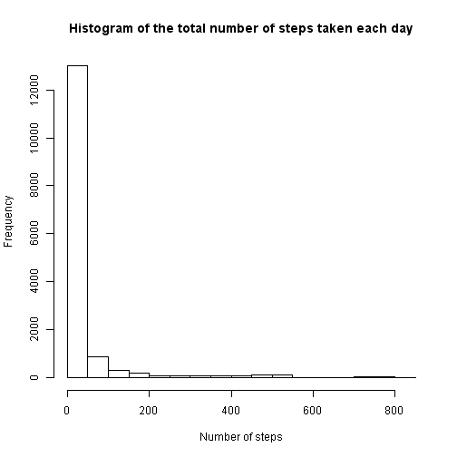

# Reproducible Research: Peer Assessment 1


## Loading and preprocessing the data

Loading the data:


```r
data <- read.csv(unz("activity.zip", "activity.csv"), sep = ",", header = TRUE)
data$date <- as.Date(data$date)
```

## What is mean total number of steps taken per day?

Missing values in the dataset are ignored.


```r
hist(data$steps, main = "Histogram of the total number of steps taken each day", xlab = "Number of steps")
```

 

Mean total number of steps taken per day:

```r
steps.mean <- mean(data$steps, na.rm = TRUE)
steps.mean
```

```
## [1] 37.38
```

Median total number of steps taken per day:

```r
steps.median <- median(data$steps, na.rm = TRUE)
steps.median
```

```
## [1] 0
```

## What is the average daily activity pattern?

Time series plot of the 5-minute interval and the average number of steps taken, averaged across all days:


```r
x <- levels(as.factor(data$interval))
y <- sapply(x, function(i) {mean(data$steps[data$interval == i], na.rm = TRUE)})
plot(x, y, type = "l")
```

 

Calculating, which 5-minute interval, on average across all the days in the dataset, contains the maximum number of steps:

```r
max.steps <- x[match(max(y), y)]
max.steps
```

```
## [1] "835"
```

## Imputing missing values

Total number of missing values in the dataset (i.e. the total number of rows with NAs):

```r
missing <- sum(!complete.cases(data))
missing
```

```
## [1] 2304
```

Missing values in the dataset are filled in with means for given 5-minute intervals.

```r
fdata <- data
for (i in seq(nrow(data))) {
    if (is.na(data$steps[i])) {
        fdata$steps[i] <- mean(data$steps[data$interval == data$interval[i]], na.rm = TRUE)
    }
}
```

Histogram of the total number of steps taken each day:

```r
hist(fdata$steps)
```

 

Mean total number of steps taken per day:

```r
steps.mean <- mean(fdata$steps)
steps.mean
```

```
## [1] 37.38
```

Median total number of steps taken per day:

```r
steps.median <- median(fdata$steps)
steps.median
```

```
## [1] 0
```

## Are there differences in activity patterns between weekdays and weekends?

Creating a new factor variable in the dataset with two levels – “weekday” and “weekend” indicating whether a given date is a weekday or weekend day:

```r
fdata$weektime <- as.factor(ifelse(as.POSIXlt(fdata$date)$wday %in% c(0,6),"weekend", "weekday"))
```


```r
par(mfrow=c(2,1))
fx1 <- levels(as.factor(fdata$interval[fdata$weektime=="weekday"]))
fy1 <- sapply(fx1, function(i) {mean(fdata$steps[fdata$weektime=="weekday" & fdata$interval == i])})
fx2 <- levels(as.factor(fdata$interval[fdata$weektime=="weekend"]))
fy2 <- sapply(fx2, function(i) {mean(fdata$steps[fdata$weektime=="weekend" & fdata$interval == i])})
plot(fx1, fy1, type = "l")
plot(fx2, fy2, type = "l")
title("My Title", outer=TRUE)
mtext("y axis", side = 2, outer = TRUE, cex = 0.7, line = 2.2, col = "grey20")
```

 
